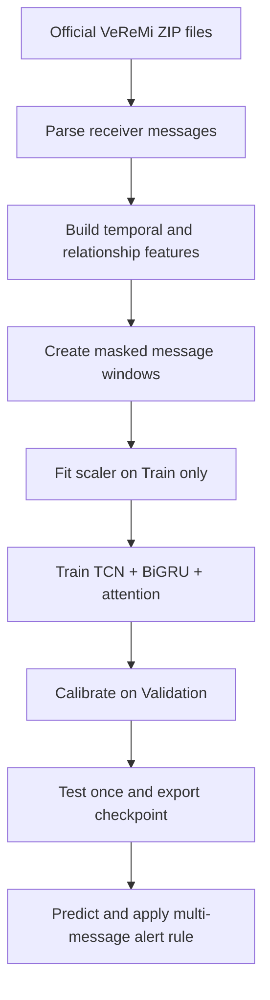

# How the detector works—from the beginning

## The task

Every received vehicle message is assigned one of three labels:

- **Normal:** the message looks consistent with an honest moving vehicle.
- **Sybil:** one physical attacker appears to operate several identities.
- **Illusion:** a vehicle sends false position or movement information.

A single message is often ambiguous. The detector therefore combines a short history for the claimed sender with relationships among all identities observed by the same receiver at roughly the same time.

## Complete workflow

## Step 1: Parse messages

The raw records describe the sender's claimed position, speed, acceleration and heading; the receiver position; timing; IDs; and whether the simulated record came from an attacker. Numbers may be stored as numbers or strings, so the parser safely handles both.

The attacker field is used only to create the training target. It is never passed to the neural network.

## Step 2: Build two types of evidence

### Behavior evidence—mainly useful for Illusion

For each claimed sender, the code calculates whether consecutive claims obey ordinary motion:

- distance moved versus reported speed;
- speed change versus reported acceleration;
- acceleration change (jerk);
- heading versus the actual direction of movement;
- yaw rate, timing, message rate, latency, and receiver-relative distance/bearing.

An Illusion attacker can alter a field, but it becomes harder to keep all fields mutually consistent over time.

### Relationship evidence—mainly useful for Sybil

For identities visible to one receiver in the same one-second bucket, the code calculates:

- how many identities are active;
- how many lie within 1, 3, and 10 metres of the target claim;
- similarity in position, speed, acceleration, heading, and movement;
- how many distinct aliases follow almost the same motion;
- optional RSSI similarity.

VeReMi's congestion Sybil attack can create an alias that appears only once. The pipeline retains these cold-start identities, left-pads their window, and supplies explicit history masks. This lets same-time relationship evidence detect them without pretending that a history exists.

## Step 3: Encode a sequence

A default sample contains the current message and up to 15 previous observations, so the sequence length is 16. Gaps larger than three seconds start a new sequence. Short sequences are padded and marked with `history_valid=0` and `relation_history_valid=0` for the artificial positions.

## Step 4: Neural-network architecture

The **behavior branch** uses:

1. A causal Temporal Convolutional Network (TCN) to find short local patterns.
2. A bidirectional GRU over the already-observed window to summarize longer dependencies.
3. Self-attention and attention pooling to focus on the most informative time steps.

The **relationship branch** uses a normalized feature projection, a BiGRU, and attention pooling. The two vectors are fused to produce probabilities for Normal, Sybil, and Illusion.

Two auxiliary training heads reinforce the intended specialization: relationship evidence predicts “Sybil or not,” and behavior evidence predicts “Illusion or not.” They are training aids; the main three-class head makes the final decision.

## Step 5: Optimize training safely

- Focal cross-entropy emphasizes difficult examples.
- Training-only inverse-frequency class weights reduce majority-class dominance.
- AdamW and weight decay regularize the model.
- Gradient clipping prevents unstable updates.
- Mixed precision accelerates supported NVIDIA GPUs.
- The learning rate is reduced when validation macro-F1 stalls.
- Early stopping keeps the best validation checkpoint.

Macro-F1 is the main selection metric because it gives equal importance to all three classes. Accuracy alone can hide poor Illusion recall when classes are imbalanced.

## Step 6: Calibrate and evaluate

After training, validation logits are temperature-calibrated. A malicious-risk threshold is selected to maximize validation macro-F1 while respecting the configured false-positive-rate limit. Reports include:

- per-class precision, recall, and F1;
- macro and weighted F1;
- balanced accuracy and overall accuracy;
- one-vs-rest ROC-AUC and PR-AUC when defined;
- false-positive rate and confusion matrix.

The program writes the exact results of your run. It does not ship invented benchmark scores.

## Step 7: Turn predictions into action

The output contains calibrated class probabilities and a suggested action. A vehicle alert requires multiple suspicious messages in a recent window by default, which reduces reactions to one noisy message. In a real safety system, the prediction should lower trust, request corroboration, or quarantine claims—not directly control the vehicle without independent safety checks.
